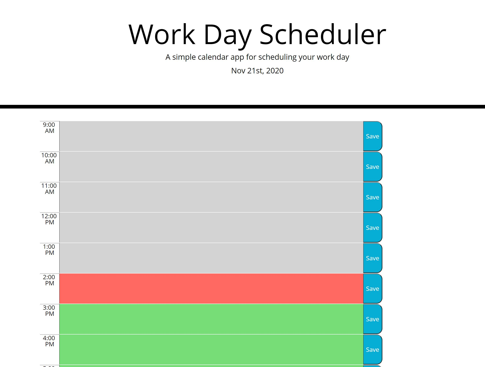

# DayPlanner
A Day planner to plan your day between 9a-5p

[Link Here](https://fainimous.github.io/DayPlanner/)

## Description 
A day planner that shows today's date during the 9-5 workday.

Takes current time and displays that time block in red.  Future times are displayed in green and past times are displayed in grey.

Create tasks and save them to the page to keep track of your activities scheduled throughout the day!

